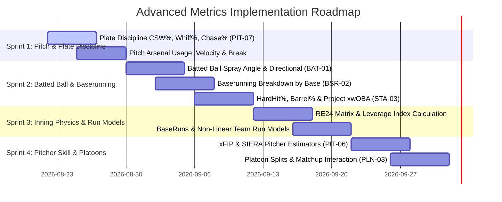

# MLB Sabermetrics & Advanced Analytics Expansion Catalog

**Status:** Approved Master Catalog & Formula Reference
**Scope:** Universal Baseball Research Metrics (Players, Plays, Pitches, Innings, Teams, Matchups)
**Methodological Citations:** FanGraphs Sabermetric Library, Tango (The Book / Linear Weights), Baseball-Reference, Statcast / Baseball Savant, Baseball Prospectus, `baseballr`, `baseball.computer`

---

## 1. Catalog Architecture & Granularity Taxonomy

To serve as the primary research database for the MLB analytics community, statistics must be defined and calculated at **six explicit grains**, with fully dynamic rolling, expanding, and windowed parameters:

```mermaid
flowchart TD
    subgraph Grain1 ["1. Pitch Grain (core.pitch / raw.statcast_pitch)"]
        P1[Pitch Types & Mix: FF, SI, SL, ST, CH, CU, FC, FS]
        P2[Velocity, Spin Rate, Induced Vertical Break, Horizontal Break]
        P3[Plate Discipline: CSW%, Whiff%, Chase%, Zone%, SwStr%]
    end

    subgraph Grain2 ["2. Plate Appearance Grain (core.play)"]
        PA1[Outcomes: 1B, 2B, 3B, HR, BB, IBB, HBP, SO, SF, SH, ROE]
        PA2[Batted-Ball Quality: EV, Launch Angle, HardHit%, Barrel%, SweetSpot%]
        PA3[Spatial Trajectory: Spray Angle, Pull%, Cent%, Oppo%]
    end

    subgraph Grain3 ["3. Inning & Base-Out State Grain"]
        I1[24 Base-Out States: 3 Outs x 8 Base Configurations]
        I2[Run Expectancy 24 Matrix - RE24 & Run Value per Event]
        I3[Leverage Index - LI, phLI, gmLI & Win Probability Added - WPA]
    end

    subgraph Grain4 ["4. Player-Game & Player-Season Grain"]
        PL1[Offense: OBP, SLG, ISO, wOBA, wRAA, wRC+, BaseRuns, BABIP]
        PL2[Pitching: FIP, xFIP, SIERA, K-BB%, WHIP, ERA, CSW%, LOB%]
        PL3[Baserunning: wSB, UBR, XBT%, Pickoff%, Stolen Base Success by Base]
        PL4[Defense: OAA, Framing Runs, Pop Time, Arm Strength, DRS]
    end

    subgraph Grain5 ["5. Team-Game & Matchup Grain"]
        T1[Team Rolling Rates: 10d, 30d, Season Expanding, Era Adjusted]
        T2[Bullpen Quality & Fatigue: Leverage-Weighted FIP, Recent Outs, 3-Day Workload]
        T3[Platoon Splits: Batter vs. Starter Handedness L/R Matchup Deltas]
        T4[Baserunning Aggregates: Team wSB, Extra Bases Taken %]
    end

    subgraph Grain6 ["6. Game & Environmental Context Grain"]
        C1[Park Factors: Single-Year & Trailing 3-Year Venue Run/HR Adjustments]
        C2[Schedule Fatigue: Rest Days, Travel Distance, Timezone Shift, Doubleheaders]
        C3[Umpire Tendency: Called Strike Rate Over Expected by Umpire ID]
    end

    Grain1 --> Grain2
    Grain2 --> Grain3
    Grain3 --> Grain4
    Grain4 --> Grain5
    Grain5 --> Grain6
```



---

## 2. Universal Metric Formulations & Mathematical Specifications

### Tier 1: Pitch Repertoire, Quality & Plate Discipline (Pitch Grain)

| Metric | Formula / Mathematical Definition | Research Significance & Stabilization |
| :--- | :--- | :--- |
| **CSW%** (Called Strikes + Whiffs %) | $\frac{\text{Called Strikes} + \text{Whiffs}}{\text{Total Pitches}}$ | **Highest single-game signal** for pitching skill; stabilizes faster than K% (~100 pitches vs ~70 BF). |
| **Whiff%** | $\frac{\text{Swings That Miss}}{\text{Total Swings}}$ | Pure swing-and-miss ability independent of take/swing decisions. |
| **SwStr%** (Swinging Strike %) | $\frac{\text{Swings That Miss}}{\text{Total Pitches}}$ | Overall swing-and-miss rate across all pitch counts. |
| **Chase%** (O-Swing%) | $\frac{\text{Swings at Pitches Outside Rulebook Zone}}{\text{Total Pitches Outside Zone}}$ | Batter plate discipline / pitcher ability to expand zone. |
| **Zone%** (In-Zone %) | $\frac{\text{Pitches in Rulebook Strike Zone}}{\text{Total Pitches}}$ | Pitcher zone control / command rate. |
| **Zone Contact%** (Z-Contact%) | $\frac{\text{Contact on Pitches in Zone}}{\text{Swings at Pitches in Zone}}$ | Ability to put hittable pitches in play. |
| **First-Pitch Strike%** (F-Strike%) | $\frac{\text{Strikes on 0-0 Count}}{\text{Total 0-0 Pitches}}$ | Count leverage driver (0-1 count wOBA is ~100 points lower than 1-0). |
| **Induced Vertical Break (IVB)** | Vertical movement in inches adjusted for gravity trajectory. | True "rise" or ride on four-seam fastballs. |
| **Horizontal Break (HB)** | Horizontal deflection from initial release angle to home plate. | Arm-side run vs. glove-side sweep. |

### Tier 2: Batted-Ball Quality, Trajectory & Directional Contact (Play Grain)

| Metric | Formula / Mathematical Definition | Research Significance |
| :--- | :--- | :--- |
| **Spray Angle ($\theta$)** | $\theta = \arctan\left(\frac{hc\_x - 125.42}{198.27 - hc\_y}\right) \times \frac{180}{\pi} \times 0.75$ | Continuous directional angle where $0^\circ$ is dead center, negative is left field, positive is right field. |
| **Directional Splits** (Pull / Cent / Oppo) | Handedness-aligned: For RHB: $\text{Pull} \iff \theta < -15^\circ$; $\text{Oppo} \iff \theta > +15^\circ$. For LHB: $\text{Pull} \iff \theta > +15^\circ$; $\text{Oppo} \iff \theta < -15^\circ$. | Pulled fly balls produce ~66% of MLB home runs from only ~18% of contact. |
| **Hard-Hit %** | $\frac{\text{Batted Balls with Exit Velocity} \ge 95\text{ mph}}{\text{Total Batted Ball Events}}$ | Stabilizes at ~40 BBE; strongly correlates with true power output. |
| **Barrel %** | EV $\ge 98\text{ mph}$ with Launch Angle within expanding window ($26^\circ\text{--}30^\circ$ at 98 mph up to $8^\circ\text{--}50^\circ$ at 116+ mph). | Generates over .500 AVG and 1.500 SLG across MLB history. |
| **Sweet-Spot %** | $\frac{\text{Batted Balls with Launch Angle between } 8^\circ \text{ and } 32^\circ}{\text{Total Batted Ball Events}}$ | Optimal line drive and fly ball launch corridor. |
| **Project xwOBA** | $\sum_{i \in \text{batted balls}} P(\text{Hit} \mid \text{EV}_i, \text{LA}_i, \text{Spray}_i) \cdot w_{\text{event}} + w_{\text{BB}}\cdot \text{BB} + w_{\text{K}}\cdot \text{K}$ | Contact quality independent of defensive positioning and park walls. |

### Tier 3: Inning Physics, Run Expectancy & Baserunning (Inning/Player Grain)

| Metric | Formula / Mathematical Definition | Research Significance |
| :--- | :--- | :--- |
| **RE24 Matrix** | $RE(B, O) = \mathbb{E}[\text{Runs scored through end of half-inning} \mid \text{Base State } B, \text{Outs } O]$ | The foundation of all linear weights and contextual value in sabermetrics. |
| **Run Value of Play ($\Delta RE$)** | $\Delta RE = RE(B_{\text{after}}, O_{\text{after}}) - RE(B_{\text{before}}, O_{\text{before}}) + \text{Runs Scored on Play}$ | Contextual run contribution of every pitch, stolen base, and hit. |
| **Leverage Index (LI)** | $LI = \frac{\sigma(WE \text{ over all potential event outcomes in current state})}{\text{Average } \sigma(WE \text{ across all MLB states})}$ | Quantitative pressure/importance of the current game moment ($1.0 = \text{average}$). |
| **BaseRuns (BsR)** | $\text{BaseRuns} = A \times \frac{B}{B + C} + D$, where:  <br>$A = \text{H} + \text{BB} - \text{HR}$, $B = [1.4\times\text{TB} - 0.6\times\text{H} - 3\times\text{HR} + 0.1\times\text{BB}] \times 1.02$, <br>$C = 3\times\text{Outs}$, $D = \text{HR}$ | Most mathematically accurate estimator of team run scoring, non-linear across run environments. |
| **Baserunning Detail (`BSR-02`)** | $\text{SB\%} = \frac{\text{SB}}{\text{SB} + \text{CS}}$, $\text{XBT\%} = \frac{\text{Extra Bases Taken}}{\text{Opportunities}}$, broken down by 2nd, 3rd, and Home. | Quantifies aggressive baserunning value beyond isolated steal attempts. |
| **wSB** (Weighted Stolen Bases) | $\text{wSB} = \text{SB}\cdot(0.20) + \text{CS}\cdot(-0.42) - lgwSB \cdot (1\text{B} + \text{BB} + \text{HBP} - \text{IBB})$ | Tango linear weights stolen base value above league average. |

### Tier 4: Pitcher Skill & Advanced Run Prevention (Player/Team Grain)

| Metric | Formula / Mathematical Definition | Research Significance |
| :--- | :--- | :--- |
| **FIP** (Fielding Independent Pitching) | $\frac{13\cdot\text{HR} + 3\cdot(\text{BB} + \text{HBP}) - 2\cdot\text{K}}{\text{IP}} + C_{\text{season}}$ | Isolates true pitcher skill from field defense and batted ball luck. |
| **xFIP** (Expected FIP) | $\frac{13\cdot(\text{FlyBalls}\times lg\text{HR/FB}) + 3\cdot(\text{BB} + \text{HBP}) - 2\cdot\text{K}}{\text{IP}} + C_{\text{season}}$ | Regresses pitcher HR volatility to league average HR/FB rate (~10.5%). |
| **SIERA** (Skill-Interactive ERA) | $\text{SIERA} = 6.145 - 16.986\left(\frac{K}{PA}\right) + 11.434\left(\frac{BB}{PA}\right) - 1.858\left(\frac{GB-FB-PU}{PA}\right) + \dots$ | Accounts for strikeout-groundball interactions and batted ball type complexity. |
| **K-BB%** (Strikeout Minus Walk %) | $\frac{\text{K} - \text{BB}}{\text{Batters Faced}}$ | Most reliable indicator of pitcher dominance and future ERA movement. |
| **Strand Rate (LOB%)** | $\frac{\text{H} + \text{BB} + \text{HBP} - \text{R}}{\text{H} + \text{BB} + \text{HBP} - (1.4\times\text{HR})}$ | Pitcher sequencing and clustering luck indicator (mean regresses to ~72%). |
| **Reliever Leverage FIP (`PIT-05`)** | $\sum_{i \in \text{relief appearances}} FIP_i \times LI_i / \sum LI_i$ | Weights bullpen performance by the actual leverage of their game entries. |

---

## 3. Dynamic Calculation Architecture (SQL & Python Framework)

### Dynamic Windowing SQL Pattern

To allow querying metrics for **any dynamic range** (e.g., trailing 10 games, trailing 30 days, expanding season, multi-year, or custom date ranges), we use parameterized SQL window definitions with strict zero-leakage constraints:

```sql
-- Dynamic Parameterized Windowing Pattern (Zero-Leakage Point-in-Time)
WITH player_events AS (
    SELECT
        p.player_id,
        g.game_date,
        g.game_number,
        g.id AS game_id,
        p.pa_count,
        p.hits,
        p.doubles,
        p.triples,
        p.home_runs,
        p.walks,
        p.unintentional_walks,
        p.hit_by_pitch,
        p.strikeouts,
        p.sacrifice_flies,
        p.at_bats,
        p.balls_in_play,
        p.hard_hit_count,
        p.barrel_count
    FROM core.player_game_stats p
    JOIN core.game g ON g.id = p.game_id
),
rolling_windows AS (
    SELECT
        player_id,
        game_id,
        game_date,
        -- Expanding Season-to-Date Window (strictly before current game)
        SUM(hits) OVER w_season AS season_hits,
        SUM(at_bats) OVER w_season AS season_ab,
        SUM(unintentional_walks) OVER w_season AS season_ubb,
        SUM(hit_by_pitch) OVER w_season AS season_hbp,
        SUM(doubles) OVER w_season AS season_2b,
        SUM(triples) OVER w_season AS season_3b,
        SUM(home_runs) OVER w_season AS season_hr,
        SUM(strikeouts) OVER w_season AS season_k,
        SUM(sacrifice_flies) OVER w_season AS season_sf,
        SUM(pa_count) OVER w_season AS season_pa,
        -- Trailing N-Game Window (e.g., 10-Game or 30-Game)
        SUM(hits) OVER w_10g AS last10_hits,
        SUM(at_bats) OVER w_10g AS last10_ab,
        SUM(pa_count) OVER w_10g AS last10_pa,
        SUM(hard_hit_count) OVER w_10g AS last10_hard_hit,
        SUM(balls_in_play) OVER w_10g AS last10_bip
    FROM player_events
    WINDOW
        w_season AS (
            PARTITION BY player_id, EXTRACT(YEAR FROM game_date)
            ORDER BY game_date, COALESCE(game_number, 0), game_id
            ROWS BETWEEN UNBOUNDED PRECEDING AND 1 PRECEDING
        ),
        w_10g AS (
            PARTITION BY player_id, EXTRACT(YEAR FROM game_date)
            ORDER BY game_date, COALESCE(game_number, 0), game_id
            ROWS BETWEEN 10 PRECEDING AND 1 PRECEDING
        )
)
SELECT
    player_id,
    game_id,
    game_date,
    -- Expanding wOBA
    CASE
        WHEN season_pa >= 10 THEN
            (0.69 * season_ubb + 0.72 * season_hbp + 0.89 * (season_hits - season_2b - season_3b - season_hr)
             + 1.27 * season_2b + 1.62 * season_3b + 2.10 * season_hr) / NULLIF(season_pa, 0)
        ELSE NULL
    END AS season_woba,
    -- Trailing 10-Game Hard-Hit%
    CASE
        WHEN last10_bip >= 5 THEN last10_hard_hit::numeric / NULLIF(last10_bip, 0)
        ELSE NULL
    END AS last10_hard_hit_pct
FROM rolling_windows;
```

---

## 4. Implementation Phasing & Work Packages



### Work Package Summary

1. **Package 1 (Plate Discipline & Pitch Sequencing - `PIT-07`)**:
   - Compute `CSW%`, `Whiff%`, `SwStr%`, `Chase%`, `Zone%`, `F-Strike%` from Retrosheet pitch sequences and Statcast tracking data.
   - Expose entering-game starting pitcher and bullpen rolling rates.
2. **Package 2 (Spatial Batted-Ball & Baserunning Detail - `BAT-01` & `BSR-02`)**:
   - Extend `core.pitch` with `(hc_x, hc_y)` trajectory coordinates.
   - Calculate spray angle, pull/center/oppo splits by batter handedness.
   - Break down baserunning stolen base attempts, success rates, pickoffs, and `XBT%` by base.
3. **Package 3 (Inning Physics, RE24 & Leverage - `RE24`/`LI`)**:
   - Construct empirical 24 base-out run expectancy matrices across MLB eras.
   - Calculate event run values and player-game WPA/LI.
4. **Package 4 (Advanced Pitcher Skill & Matchups - `xFIP`/`SIERA`/`PLN-03`)**:
   - Calculate xFIP and SIERA.
   - Build batter-vs-pitcher handedness platoon splits (L/R, R/L, L/L, R/R).
