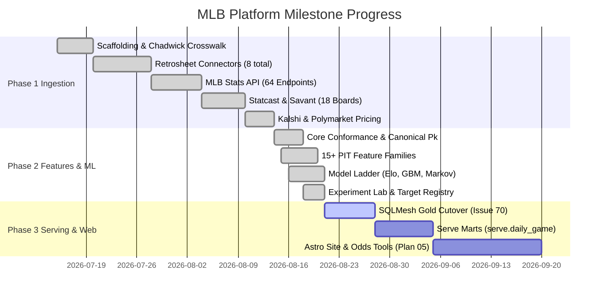

# MLB Platform Comprehensive Project Assessment & Enhancement Plan

**Date:** 2026-08-21
**Project:** MLB Research, Forecasting, and Odds-Analysis Platform
**Target Repository:** `/home/cbwinslow/workspace/mlb`
**System of Record:** PostgreSQL (`mlb` production / `mlb_test` integration)

---

## 1. Executive Summary & Overall Architecture Assessment

The MLB baseball analytics and forecasting platform represents an **exceptionally rigorous, production-grade data engineering and predictive modeling architecture**. Unlike common open-source sabermetric scripts that suffer from data leakage, unversioned constants, and unmaintainable monolithic scripts, this project enforces strict software engineering, data governance, and statistical discipline:

```mermaid
flowchart TD
    subgraph Raw Layer ["Raw Layer (Source-Faithful Landing)"]
        R1[Retrosheet Events & Logs 1871-2025]
        R2[MLB Stats API 64 Endpoints + Live 2026]
        R3[Statcast Pitch 2008-2026 + 18 Leaderboards]
        R4[Kalshi & Polymarket Intraday Snapshots]
        R5[Baseball-Reference WAR & Stats]
        R6[Lahman & RSS News]
    end

    subgraph Core Layer ["Core Layer (Conformed Identities & Facts)"]
        C1[core.player & core.team]
        C2[core.game & core.venue]
        C3[core.play & core.pitch (Season Partitioned)]
        C4[core.market & core.player_war]
    end

    subgraph Gold Layer ["Gold Layer (Derived Features & Marts)"]
        G1[gold.game_feature (15+ Point-in-Time Families)]
        G2[gold.prediction & gold.total_prediction]
        G3[gold.reporting_* & gold.game_export]
    end

    subgraph Meta Layer ["Meta Layer (Provenance & Governance)"]
        M1[meta.ingestion_run & item_ledger]
        M2[meta.model & feature_snapshot]
        M3[meta.experiment_run & target_registry]
    end

    subgraph Serving Layer ["Serve Layer (Plan 05 - Astro Site)"]
        S1[serve.daily_game & serve.game_detail]
        S2[serve.model_scorecard & research_queries]
    end

    Raw Layer -->|mlb conform / identity crosswalk| Core Layer
    Core Layer -->|SQLMesh & model/*.py| Gold Layer
    Gold Layer -->|mlb train / mlb predict| Meta Layer
    Gold Layer -->|SQLMesh serve marts| Serving Layer
```

### Key Architectural Strengths
1. **Point-in-Time Correctness & Zero-Leakage Discipline**: Feature engineering explicitly uses expanding and rolling historical windows strictly before game cutoff timestamps (`ROWS BETWEEN UNBOUNDED PRECEDING AND 1 PRECEDING`), day-collapse `RANGE` frames for doubleheaders, and pregame capture timestamps for market lines.
2. **Deterministic Dual-Database Isolation**: Absolute physical and logical boundary between `mlb` (production) and `mlb_test` (disposable test database) enforced via `tests/conftest.py::_assert_test_database_url`.
3. **No Mocking Database Policy**: Integration tests run against a real, dedicated PostgreSQL database with genuine transaction isolation, foreign keys, partition constraints, and idempotency checks (test run twice = exact same state).
4. **Governed Feature Admission**: Features enter through a ranked, evidence-based admission queue (`docs/archive/FEATURE_ADMISSION_QUEUE.md`) with explicit null policies, denominator guards, hand-calculated test fixtures, and strict promotion thresholds (e.g. >= 0.002 log-loss improvement over Elo).
5. **Durable Architecture Decision Records (ADRs)**: Over 88 documented ADRs in `docs/DECISIONS.md` capturing every trade-off, benchmark, negative result, and bug resolution.

---

## 2. Policy, Rules, and Guidelines Verification

| Rule / Policy Area | Stated Policy | Implementation & Enforcement | Current Status |
| :--- | :--- | :--- | :--- |
| **Database Safety** | Never run destructive queries on `mlb`. `TEST_DATABASE_URL` must point to `mlb_test`. | `tests/conftest.py` guards against non-test db names. Hard failure on missing "test" substring. | ✅ **Verified & Compliant** |
| **Data Source Rights & Budget** | Strict $0/month budget. No paid APIs. `PUBLIC_SAFE` vs `LOCAL_RESEARCH` separation. | `docs/DATA_SOURCES.md`, `docs/SOURCE_RIGHTS.md`, `mlb_baseball/source_profiles.py`. Statcast isolated to research. | ✅ **Verified & Compliant** |
| **Testing Standards** | Real Postgres for DB integration tests; mock network only; test CLI dispatch; test idempotency. | 980+ automated tests across `tests/unit/` and `tests/integration/`. | ✅ **Verified & Compliant** |
| **Code & Type Quality** | Strict Ruff linting, MyPy type safety (0 errors across 77 files), no dead code, no silent `except: pass`. | CI pipeline `.github/workflows/ci.yml` runs `ruff`, `mypy`, `sqlfluff`, and custom SQL ownership linter. | ✅ **Verified & Compliant** |
| **SQL Ownership** | Static/set-based SQL in named `.sql`/SQLMesh files; procedural/dynamic composition in Python. | `docs/SQL_OWNERSHIP.md` and `scripts/lint_sql_ownership.py` AST linter. | ✅ **Verified & Compliant** |
| **Modeling Discipline** | Chronological walk-forward validation; compare against Elo/Log5/Market baselines; Brier & Log-Loss evaluation. | `meta.experiment_run`, `meta.target_registry`, `mlb_baseball/model/experiment.py`, `docs/EXPERIMENT_RUNBOOK.md`. | ✅ **Verified & Compliant** |

---

## 3. Libraries, Tools, and PostgreSQL Extensions Evaluation

### A. PostgreSQL Extensions: Current State vs. Recommended Enhancements

| Extension | Current Status | Proposed Use Case & Rationale | Priority |
| :--- | :--- | :--- | :--- |
| **`pg_stat_statements`** | ✅ Active (Migration 0024) | Query execution time and bottleneck analysis for long-running feature transformations. | Maintained |
| **`pg_trgm`** | 💡 *Recommended* | **Fuzzy Player & Bio Crosswalking**: Powers trigram similarity matching for unlinked players, international signings, minor-league callups, and news/injury mentions where name spellings/accents vary. | **High** |
| **`btree_gist`** | 💡 *Recommended* | **Temporal Consistency & Exclusion Constraints**: Allows range-based exclusions (e.g. guaranteeing no overlapping active roster dates or conflicting transaction intervals). | **Medium** |
| **`pgvector`** | 💡 *Recommended* | **Player & Pitch Repertoire Embeddings**: Enables vector similarity for pitcher arsenal distributions, batter spray heatmaps, and finding historical "comparable teams" for simulation. | **Medium (Phase 2/3)** |
| **`tablefunc`** | 💡 *Recommended* | **Crosstab Reporting**: Simplifies multi-season matrix pivoting directly in PostgreSQL for serve marts and reporting views without Python overhead. | **Low** |

### B. Python Libraries & Ecosystem Assessment

| Category | Current Libraries | Recommended Additions / Enhancements | Value Proposition |
| :--- | :--- | :--- | :--- |
| **Data & Vector Engine** | `pandas>=2.0`, `numpy>=1.26` | **`polars`** or **`duckdb`** (via `duckdb-postgres`) | While PostgreSQL handles heavy set-based transforms, local out-of-core feature generation and simulation can leverage DuckDB's zero-copy PostgreSQL scanner for 10x-50x speedups on large tabular sweeps. |
| **ML & Tuning** | `xgboost>=2.0`, `scikit-learn>=1.4` | **`optuna`** | XGBoost hyperparameters are currently static in `gbm.py`. Optuna provides automated Bayesian hyperparameter search constrained by walk-forward CV log-loss. |
| **Explainability** | None (hand-coded delta metrics) | **`shap`** | Enables per-game SHAP waterfall attributions ("Why is Team A favored by 4.2% today?"). Directly fulfills the Astro site's requirement for forecast-change explanations. |
| **Calibration** | Manual log-loss & Brier decomposition | **`scikit-learn.calibration`** (Platt Scaling / Isotonic Regression) | Calibrates raw classifier output probabilities against empirical bin rates, addressing known probability overconfidence. |
| **Transformations** | `sqlmesh[postgres]>=0.236.1` | **SQLMesh for Gold Features** (ADR-088) | Cut over set-based Python feature writers (`model/*.py`) to declarative SQLMesh models with automated lineage and virtual staging. |
| **Serving & Web** | CLI-driven | **Astro + Tailwind CSS + FastAPI / Static JSON** | High-performance Astro static site with reactive client islands for odds calculations, simulation replays, and matchup explorers. |

---

## 4. Validation of Completed Work to Date



### Verified Implementation Milestones
- **Core Identity Remediation (Plan 01)**: Migration `0056` resolved canonical game identity (`game_pk` uniqueness), multi-pass team matching, and doubleheader chronological ordering (`game_number` tie-breakers).
- **Feature Engineering Platform (Plan 03)**:
  - `team_rate.py` (OBP, SLG, ISO, BB%, K%, BABIP, Run Environment)
  - `offense.py` (FanGraphs wOBA formula reproduction, wRC+ league/park adjusted)
  - `starter.py` & `starter_workload.py` (FIP, K/BB/HR components, 7-day workload, rest days, live 2026 & probable pitcher resolution)
  - `bullpen.py` (Fatigue metrics, reliever outs, live 2026 support)
  - `bsr.py` (wSB stolen base run value with advance-flag accounting)
  - `diff.py` & `trend.py` (Home-minus-away differences, rolling vs. expanding trend)
  - `experience.py` & `age.py` (Starter career BF/IP and pitcher exact age)
- **Modeling & Experimentation Framework (Plan 04)**:
  - Experiment tracking (`meta.experiment_run`, `meta.experiment_snapshot`, `meta.target_registry`).
  - Stepwise forward feature selection (`feature_select_stepwise.py`).
  - Strict empirical validation: ADR-086 documents the retrain experiment where adding workload/prior defense yielded 0.6792 log-loss (vs 0.6801 Elo), rigorously adhering to the 0.002 promotion threshold and declining unearned champion promotion.

---

## 5. Roadmap & Future Tasks Action Plan

### Immediate Action Items (Sprint 1)
1. **Execute SQLMesh Gold Feature Cutover ([Issue #70](https://github.com/cbwinslow/mlb-baseball/issues/70))**:
   - Port pure set-based Python feature writers (`park.py`, `bsr.py`, `diff.py`, `trend.py`, `experience.py`) into declarative SQLMesh models.
   - Wire SQLMesh plan/run checks into CI.
2. **Implement Next Feature Admission Candidates**:
   - **`BSR-02`**: Baserunning detail broken out by base (2nd/3rd/home, pickoffs, extra bases taken).
   - **`BAT-01`**: Batted-ball spray angle × handedness (execute `core.pitch` schema extension and tag as `local_research`).
   - **`PIT-07`**: Pitch-sequence rate stats (swing%, contact%, whiff%, foul% from Retrosheet pitch sequence codes).
3. **Resolve Open Gaps & Technical Debt**:
   - Close Issue #9 (items 3/4) and Issue #32 (team rate join-failure coverage health check).
   - Close Issue #67 (`starter.py` doubleheader-ordering tie-breaker).

### Medium-Term Action Items (Sprint 2 - Plan 04 Modeling & Calibration)
1. **Post-Hoc Probability Calibration**: Integrate Platt scaling and Isotonic regression into `mlb_baseball/model/evaluation.py` and `gbm.py` to produce well-calibrated game probabilities.
2. **Hyperparameter Tuning Harness**: Add an optional `Optuna` tuning stage for XGBoost with walk-forward CV log-loss objective.
3. **Model Explainability Engine**: Implement `SHAP` tree-explainer to store game-level feature contribution weights into `gold.prediction_attribution`.

### Long-Term Action Items (Sprint 3 - Plan 05 Astro Serving & Launch)
1. **Design `serve` Schema Marts**:
   - `serve.daily_game` (upcoming matchups, starter ratings, bullpen state, model predictions, market comparison).
   - `serve.game_detail` (full point-in-time feature breakdown, weather, park factor, head-to-head history).
   - `serve.model_scorecard` (historical calibration curves, Brier scores, daily ROI/EV tracking).
2. **Build Astro Static/Island Site**:
   - Responsive, clean UI with zero competitor asset copying.
   - Client-side interactive odds calculator, line movement explorer, and research query interface.
